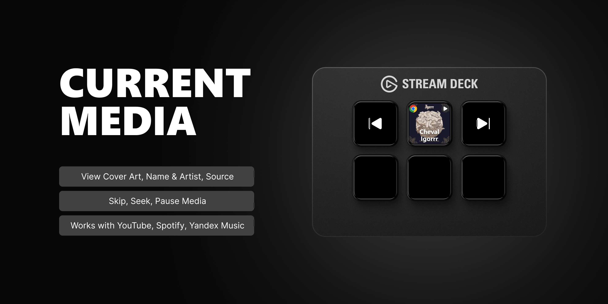

[English](README.md) | [Русский](README.ru.md)

# Current Media (Now Playing)

A Stream Deck plugin that displays information about the currently playing media from various sources and provides advanced playback controls.

## Features

- **Dynamic Display**: Shows the cover art, title, and artist, as well as the source: Spotify, Chrome, etc.
- **Large Cover Art Mode**: Combine a 2x2 grid of keys to display a single large cover image.
- **Playback Controls**: Dedicated actions for Play/Pause, Next, and Previous track.
- **Seek Functionality**: Actions for seeking forward/backward.
- **Fully Customizable**: Configure what happens on key press, whether to display the media source, title, or artist, etc.
- **Wide Compatibility**: Works with any application that integrates with the Windows Media Session API (e.g., Spotify, Chrome, Yandex Music).

## Requirements

- **Elgato Stream Deck Software**: Version 6.9 or higher
- **Operating System**: Windows 10 or higher

## Manual Installation

1. Download the latest version from the [Releases](https://github.com/valentderah/stream-deck-current-media/releases) page.
2. Double-click the downloaded `.streamDeckPlugin` file to install.

## Plugin in the Store
Coming soon to the Elgato Marketplace.
