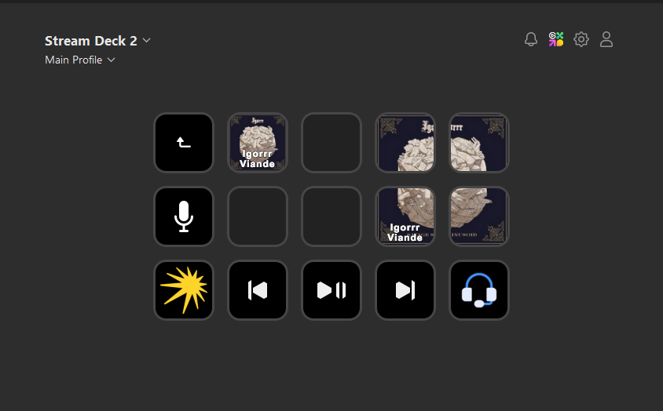

[English](README.md) | Русский

# Media Manager

Этот плагин создан для пользователей Stream Deck. Он отображает информацию о текущем воспроизводимом медиа.

### Ручная установка
1. Скачайте последнюю версию со страницы [Releases](https://github.com/valentderah/media-manager/releases)
2. Распакуйте папку `ru.valentderah.media-manager.sdPlugin`
3. Откройте приложение Stream Deck
4. Перейдите в магазин Stream Deck (меню из трёх точек) и нажмите "Больше действий" → "Установить с диска"
5. Выберите папку `ru.valentderah.media-manager.sdPlugin`

### Плагин в магазине
Скоро в магазине Stream Deck...

## Возможности

- Плагин отображает информацию о текущем медиа с обложкой альбома, названием и исполнителями
- Дает возможность перехода между медиа и установка/снятие с паузы

## Требования

- Elgato Stream Deck Software 6.9 или выше
- Windows 10 и когда-нибудь macOS 12 или выше
- Поддерживаемые медиаплееры (совместимые с Windows Media Session API)